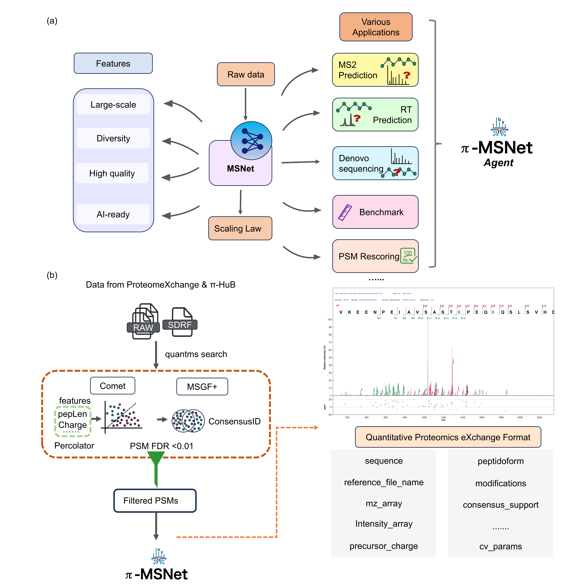
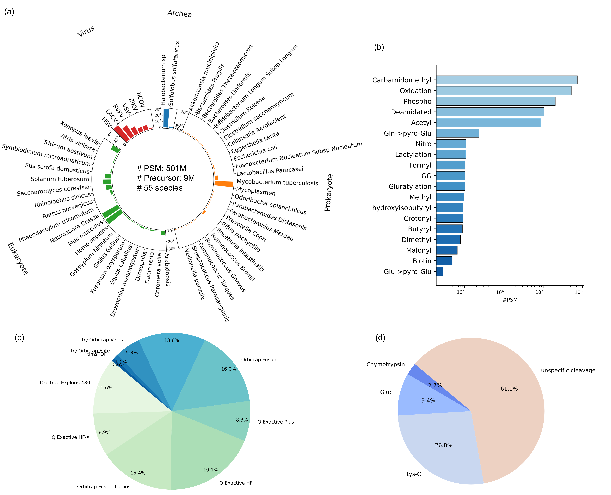

# π-MSNet: A billion-scale, AI-Ready living proteomics data Portal

  

π-MSNet is a high-quality, large-scale, living data portal for computational proteomics. It provides standardized, AI-ready datasets for training, benchmarking, and developing machine learning models in proteomics. The portal integrates diverse mass spectrometry (MS) datasets from public repositories and in-house projects, offering unprecedented scale, diversity, and reproducibility.

## Overview

Proteomics increasingly relies on data-driven methods, particularly deep learning, to interpret complex mass spectrometry data. Existing datasets are often fragmented, incompletely annotated, or limited in scale, impeding reproducibility and fair benchmarking. π-MSNet addresses these limitations by providing a continuously updated, standardized, and scalable dataset resource that supports AI model development across diverse experimental conditions.

Key highlights of π-MSNet:

- **501 million peptide-spectrum matches (PSMs) and 9 million precursors** from 55 species, including eukaryotes, prokaryotes, viruses, and archaea.
- **1.66 billion MS² spectra** from 36,356 LC–MS/MS runs across 114 projects (~30 TB of raw data).
- Data acquired on **ten different mass spectrometer types** and processed with diverse fragmentation strategies.
- PSMs cover both **typical tryptic peptides** and peptides from **non-specific, Lys-C, Glu-C, and chymotrypsin cleavage**.
- Uniformly annotated in **SDRF format**, following the HUPO-PSI metadata standard.
- Stored in the **QPX Parquet format** for scalable, fast access and reduced storage requirements.

## Data Processing Workflow

1. **Data Curation:** Collected 114 public datasets from ProteomeXchange and π-HuB projects, covering diverse species, instruments, and experimental strategies.
2. **Uniform Annotation:** All datasets were standardized using SDRF format.
3. **Reanalysis:** MS² spectra were processed with the open-source [quantms](https://github.com/bigbio/quantms) workflow, integrating results from multiple search engines (e.g., MS-GF+ and Comet) to improve PSM robustness.
4. **Data Export:** PSMs and metadata exported to QPX Parquet format, optimized for rapid access, reduced storage (96% smaller than CSV), and efficient downstream AI workflows.
5. **Model Benchmarking:** Existing deep learning models were retrained and benchmarked on the π-MSNet dataset to demonstrate performance improvements.

  
*Figure 1: π-MSNet processing workflow.*

## Retention Time Prediction Example

- RT prediction captures peptide elution behavior in chromatography.
- A subset of 933,526 peptides from three projects (IPX0000937001, IPX0001289001, IPX0001804001) was used for training and testing models such as GPTime, AutoRT, and DeepLC.
- RT and peptide length distributions are available in Supplementary Note 3, Fig. 4.

## Data Access

- Interactive portal: [π-MSNet Portal](https://msnet.ncpsb.org.cn)  
- Dataset downloads and documentation: [π-MSNet Portal](https://msnet.ncpsb.org.cn) and [quantms Datasets](https://quantms.org/datasets)

## Citation

If you use π-MSNet in your research, please cite:
