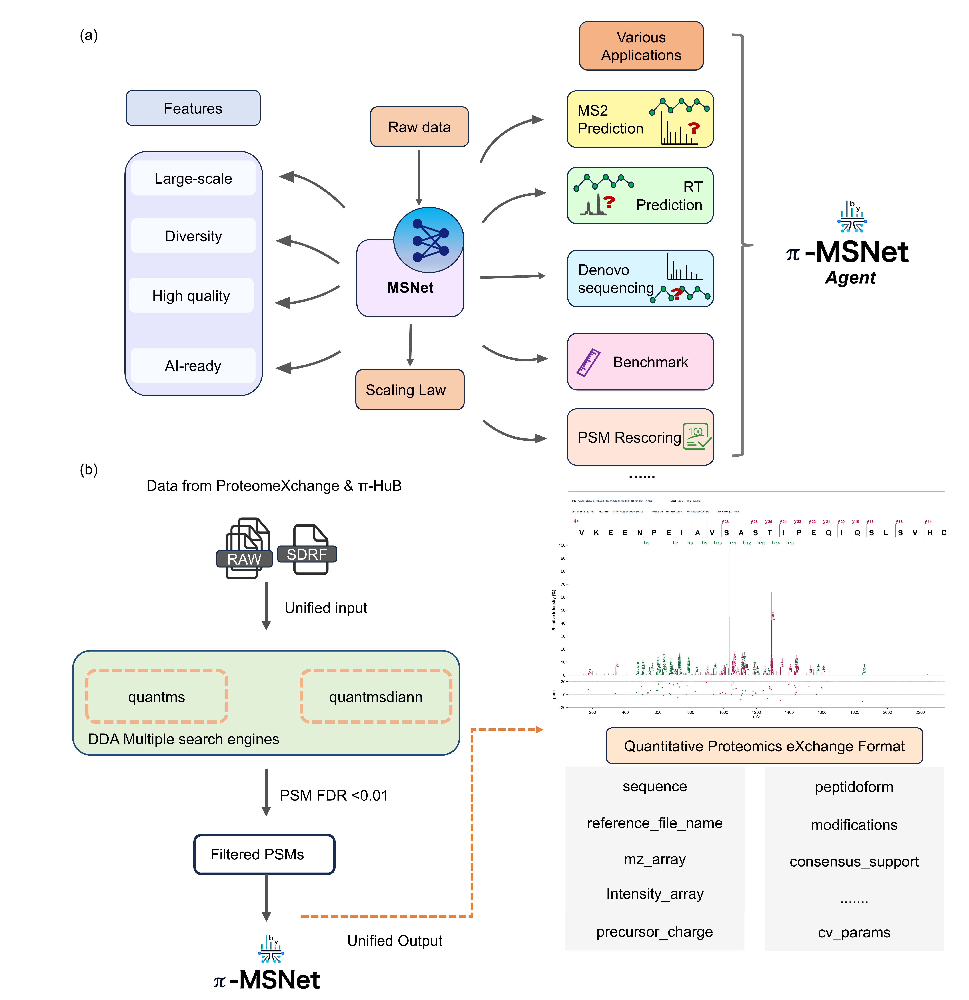
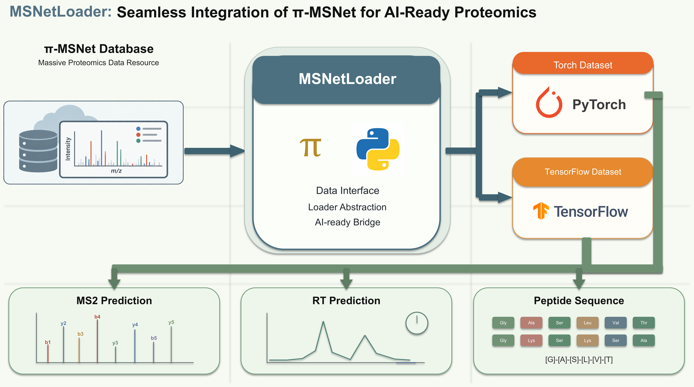

# π-MSNet: A large-scale, AI-ready, continuously reprocessed proteomics data portal

[](LICENSE)
[](https://www.python.org/downloads/)
[](https://zenodo.org/records/20792504)



π-MSNet is a large-scale, AI-ready portal for computational proteomics. It provides standardized, AI-ready datasets for training, benchmarking, and developing machine learning models in proteomics. The portal integrates diverse mass spectrometry (MS) datasets from public repositories and in-house projects, offering unprecedented scale, diversity, and reproducibility.

**Contents:** [Data Access](#data-access) · [Repository Layout](#repository-layout) · [Data Processing Workflow](#data-processing-workflow) · [MSNetLoader](#msnetloader-efficient-data-loading-for-π-msnet) · [Reproducing the Manuscript Analyses](#reproducing-the-manuscript-analyses) · [Citation](#citation) · [License](#license) · [Contact](#contact)

## Data Access

| Resource       | Link                                                                     | Contents                                           |
| -------------- | ------------------------------------------------------------------------ | -------------------------------------------------- |
| π-MSNet portal | [msnet.ncpsb.org.cn](https://msnet.ncpsb.org.cn)                         | Dataset search, download, and documentation        |
| quantms portal | [portal.quantms.org/collections](https://portal.quantms.org/collections) | Collection listing and versioned dataset files     |
| Zenodo archive | [zenodo.org/records/20792504](https://zenodo.org/records/20792504)       | Trained models, predictions, and benchmarking data |

## Repository Layout

| Path                                                                     | Contents                                                                |
| ------------------------------------------------------------------------ | ----------------------------------------------------------------------- |
| [`MSNetLoader/`](MSNetLoader/)                                           | Python package for downloading, splitting, and loading π-MSNet datasets |
| [`manuscript/`](manuscript/)                                             | Analysis code reproducing the manuscript figures                        |
| [`manuscript/Figure2.py`](manuscript/Figure2.py)                         | Data-overview figure (species, instrument, enzyme, digestion)           |
| [`manuscript/parquet_performance.py`](manuscript/parquet_performance.py) | QPX Parquet file-size and I/O benchmarks                                |
| [`manuscript/MS2/`](manuscript/MS2/)                                     | MS² spectrum prediction: training pipeline and Figure 3                 |
| [`manuscript/MSNet-denovo/`](manuscript/MSNet-denovo/)                   | De novo peptide sequencing: Figure 5                                    |
| [`manuscript/RT/`](manuscript/RT/)                                       | Retention time benchmarking and scaling-law analysis                    |
| [`assets/`](assets/)                                                     | Figures used in this README                                             |

Each manuscript sub-directory contains its own README with file-level details, inputs, and commands.

## MSNetLoader: Efficient Data Loading for π-MSNet

MSNetLoader is a Python package designed to streamline access to π-MSNet datasets in QPX Parquet format. It enables efficient loading of PSMs, retention times, and de novo inputs, supports metadata-driven dataset selection, and integrates seamlessly with PyTorch and TensorFlow workflows.



**Key features:**

- **Streaming loaders** backed by DuckDB — batches are read directly from Parquet with minimal memory overhead.
- **Queries pushed down to the loaders**: filter by consensus support, posterior error probability, or arbitrary SQL conditions without copying data.
- **Task-specific datasets**: MS² spectrum prediction, retention time prediction, and de novo sequencing, each in a PyTorch and a TensorFlow variant.
- **Leakage-free splits**: deterministic peptide-level hash partitions shared across all PSMs of the same peptidoform.
- **Built-in downloader** with resume support, for single accessions or metadata-selected dataset sets.

### Installation

MSNetLoader requires Python ≥ 3.10:

```bash
git clone https://github.com/daichengxin/MSnet.git
pip install -e MSNetLoader
```

The package depends on `duckdb`, `pandas`, `numpy`, `pyarrow`, and `torch` / `tensorflow`, which are installed along with it. Inside `MSNetLoader/`, `uv sync` installs the same dependencies from the pinned `uv.lock` instead.

### Downloading datasets

`download_dataset` fetches all or selected files of a project accession. The default source is the official EBI FTP mirror; the browse.quantms.org listing is also supported, and full dataset URLs are accepted as-is:

```python
from msnetloader import download_dataset, list_remote_files

# see what a project ships
list_remote_files("PXD021013")
# ['PXD021013-MSNet.parquet', 'PXD021013.dataset.parquet', ...]

# download only the small metadata files
download_dataset("PXD021013", data_dir="data/PXD021013", files=["dataset", "run", "sample"])

# download everything, including the (large) main PSM parquet
download_dataset("PXD021013", data_dir="data/PXD021013", files="all")
```

Interrupted downloads are resumed automatically from the `*.part` file; pass `force=True` to re-download existing files.

Datasets can also be selected by experimental metadata instead of hard-coded accessions. Metadata is fetched once from the quantms portal and cached for 24 h in `~/.cache/msnetloader`:

```python
from msnetloader import download_by_metadata, fetch_collection_metadata, search_datasets

# inspect the whole collection (114 datasets in the msnet collection)
metadata = fetch_collection_metadata()

# filter: any substring, case-insensitive; lists match if any value matches
hits = search_datasets(datasets=metadata, instrument="Orbitrap", enzyme="Trypsin")

# one-liner: search and download the matches (at least one filter is required)
download_by_metadata(
    data_dir="data",
    files=["dataset", "run"],          # metadata first; use ["msnet"] for the spectra
    enzyme="Trypsin",
    instrument="Orbitrap Fusion Lumos",
    species="Homo sapiens",
    min_psms=1_000_000,
)
```

Filters understood: `enzyme`, `instrument`, `species`, `superkingdom`, `fragment_method`, `label`, `acquisition_method`, `accessions` (substring), `min_psms`, `max_psms`, `min_runs`, `max_runs`. Each dataset lands in `<data_dir>/<accession>/`.

### Loading MS² spectra

```python
from torch.utils.data import DataLoader
from msnetloader.ms2_loader import MS2TorchDataset

dataset = MS2TorchDataset(
    "data/PXD014877-Akkermansia_muciniphilia-MSNet.parquet",  # a path or a list of paths
    batch_size=16,
    ion_types=("b", "y"),
    charges=(1, 2),
    min_consensus_support=1,   # optional quality filters
    max_pep=0.01,
)
dataloader = DataLoader(dataset, batch_size=None, num_workers=0, pin_memory=False)

for batch in dataloader:
    # batch["peptide"]      peptidoforms of the batch
    # batch["charge"]       precursor charges, torch tensor
    # batch["nce"]          normalized collision energies, torch tensor
    # batch["instruments"]  instrument names
    # batch["targets"]      fragment intensities, tensor of shape (batch, nAA-1, 4)
    ...
```

The four fragment-intensity channels are `b1`, `b2`, `y1`, `y2`. A TensorFlow equivalent is available as `MS2TFDataset(...).get_dataset()`.

### Loading retention times and de novo inputs

```python
from msnetloader.rt_loader import RTIterableDataset
from msnetloader.denovo_loader import DeNovoIterableDataset

# retention time prediction: {"peptide": [...], "rt": <minutes>}
rt_dataset = RTIterableDataset("data/PXD014877-Akkermansia_muciniphilia-MSNet.parquet")

# de novo sequencing: top-N peaks per spectrum, max-normalized
denovo_dataset = DeNovoIterableDataset(
    "data/PXD014877-Akkermansia_muciniphilia-MSNet.parquet",
    max_peaks=150,
)
# each batch: {"spectrum": [...], "sequence": [...], "precursor_mz": ..., "charge": ...}
```

TensorFlow variants are available as `RTTFDataset` and `DeNovoTFDataset`.

### Train / validation / test splits

Splits are computed as a deterministic hash partition of the peptide identifier (`peptidoform`), so all PSMs of a peptide stay in the same split (no data leakage) and the same peptide always lands in the same split for a given seed.

Push the split conditions down to the loaders without copying any data:

```python
from msnetloader import split_conditions
from msnetloader.ms2_loader import MS2TorchDataset

conditions = split_conditions(test_size=0.1, val_size=0.1, seed=42)

train_set = MS2TorchDataset("data/PXD021013-MSNet.parquet", extra_where=conditions["train"])
val_set = MS2TorchDataset("data/PXD021013-MSNet.parquet", extra_where=conditions["val"])
test_set = MS2TorchDataset("data/PXD021013-MSNet.parquet", extra_where=conditions["test"])
```

Or materialize standalone train/test parquet files:

```python
from msnetloader import split_dataset, split_files, split_peptides

# write <prefix>train.parquet / <prefix>test.parquet
split_dataset("data/PXD021013-MSNet.parquet", output_dir="splits", test_size=0.1, seed=42)

# get the peptide lists per split
peptides = split_peptides("data/PXD021013-MSNet.parquet", test_size=0.1, seed=42)

# coarse file-level split across multiple projects
split_files(["data/PXD021013-MSNet.parquet", "data/PXD014877-MSNet.parquet"], test_size=0.2, seed=42)
```

### Development

```bash
cd MSNetLoader
pytest tests
# opt-in live network test against the real quantms mirror:
MSNETLOADER_LIVE_TESTS=1 pytest tests/test_download.py
```

## Reproducing the Manuscript Analyses

The analysis code lives under [`manuscript/`](manuscript/). Large inputs and trained models are not stored in this repository; they are available on [Zenodo](https://zenodo.org/records/20792504). See the README in each sub-directory for the required inputs and outputs:

- [MS2/README.md](manuscript/MS2/README.md) — training the MS² prediction model and reproducing Figure 3.
- [MSNet-denovo/README.md](manuscript/MSNet-denovo/README.md) — de novo sequencing and Figure 5.
- [RT/Readme.md](manuscript/RT/Readme.md) — retention time benchmark and scaling-law workflow, with a reproducible environment in [RT/ENVIRONMENT.md](manuscript/RT/ENVIRONMENT.md).

## Citation

If you use π-MSNet in your research, please cite:

Dai, C. et al. π-MSNet: A billion-scale, AI-ready living proteomics data portal. bioRxiv, 2026.2004.2013.718149 (2026).
[Link](https://www.biorxiv.org/content/10.64898/2026.04.13.718149v1)

## License

This project is distributed under the GNU General Public License v3.0 — see [LICENSE](LICENSE).

## Contact

Questions, bug reports, and feature requests are welcome via [GitHub Issues](https://github.com/daichengxin/MSnet/issues).
